# Архитектура

Документ фиксирует сквозную архитектуру проекта как один поток данных: от
офлайн-обучения и построения baseline до онлайн-инференса, отложенных меток,
мониторинга, инцидентов, дашбордов и автоматизированных реакций.

## Схема системы

```mermaid
flowchart TB
    subgraph Offline["Офлайн-подготовка"]
        Dataset["Набор Bank Marketing"]
        Train["app.train.train"]
        Model["artifacts/models/bank_marketing_model.joblib"]
        Baseline["artifacts/baselines/baseline_profile.json"]
        Dataset --> Train
        Train --> Model
        Train --> Baseline
    end

    subgraph Serving["Онлайн-serving"]
        Client["Клиент или симулятор"]
        Simulator["app.simulator.generate_stream"]
        API["FastAPI /predict"]
        RuntimePolicy["Runtime policy\nпорог/ручная проверка"]
        Metrics["Метрики Prometheus\napp.common.metrics"]
        Client --> API
        Simulator --> API
        Model --> API
        Baseline --> API
        RuntimePolicy --> API
        API --> Metrics
    end

    subgraph Data["Операционные хранилища"]
        InferenceLog["PostgreSQL.inference_log"]
        GroundTruth["PostgreSQL.ground_truth"]
        DriftRuns["PostgreSQL.monitoring_runs"]
        DriftMetrics["PostgreSQL.drift_metrics"]
        QualityRuns["PostgreSQL.quality_runs"]
        QualityMetrics["PostgreSQL.quality_metrics"]
        QualityEstimates["PostgreSQL.quality_estimates"]
        Incidents["PostgreSQL.monitoring_incidents"]
        Actions["PostgreSQL.monitoring_actions"]
    end

    subgraph Labels["Отложенные метки"]
        LabelManifest["Сохраненные manifests"]
        Backfill["app.monitoring.backfill_labels\n/labels, /labels/batch"]
        LabelManifest --> Backfill
        Backfill --> GroundTruth
    end

    subgraph Monitoring["Контур мониторинга и управления"]
        Scheduler["app.monitoring.scheduler"]
        DriftJob["app.monitoring.drift_job\n+ drift_detectors"]
        QualityJob["app.monitoring.quality_job\n+ unlabeled_quality"]
        IncidentSync["app.monitoring.incidents"]
        Reaction["app.monitoring.reaction_engine"]
        Scheduler --> DriftJob
        Scheduler --> QualityJob
        DriftJob --> IncidentSync
        QualityJob --> IncidentSync
        IncidentSync --> Incidents
        Incidents --> Reaction
        Reaction --> Actions
        Actions --> RuntimePolicy
    end

    subgraph Observability["Наблюдаемость и интерфейсы оператора"]
        Prometheus["Prometheus"]
        Alertmanager["Alertmanager"]
        EmailRelay["Email-релей / SMTP"]
        Grafana["Дашборды Grafana"]
        Overview["Overview API и /overview UI"]
    end

    API --> InferenceLog
    GroundTruth --> QualityJob
    InferenceLog --> DriftJob
    InferenceLog --> QualityJob
    Model --> DriftJob
    Baseline --> DriftJob
    Baseline --> QualityJob

    DriftJob --> DriftRuns
    DriftJob --> DriftMetrics
    QualityJob --> QualityRuns
    QualityJob --> QualityMetrics
    QualityJob --> QualityEstimates

    Metrics --> Prometheus
    Prometheus --> Alertmanager
    Alertmanager --> EmailRelay
    Prometheus --> Grafana
    InferenceLog --> Grafana
    DriftRuns --> Grafana
    DriftMetrics --> Grafana
    QualityRuns --> Grafana
    QualityMetrics --> Grafana
    QualityEstimates --> Grafana
    Incidents --> Grafana
    Actions --> Grafana

    InferenceLog --> Overview
    DriftRuns --> Overview
    QualityRuns --> Overview
    Incidents --> Overview
```

## Основной поток

1. `app.train.train` обучает классификатор и записывает артефакт модели и
   baseline-профиль.
2. `FastAPI /predict` загружает эти артефакты, выполняет инференс, применяет
   текущую runtime policy, публикует метрики Prometheus и записывает каждый
   запрос в `inference_log`.
3. Отложенные метки приходят позже через `/labels` или `/labels/batch`, обычно
   из `app.monitoring.backfill_labels`, и сохраняются в `ground_truth`.
4. `app.monitoring.scheduler` периодически запускает задачи дрейфа и качества
   для глобального потока и, при необходимости, для настроенных сегментов.
5. `app.monitoring.drift_job` читает последние окна инференса и baseline,
   запускает одномерные и многомерные детекторы, затем записывает
   `monitoring_runs` и `drift_metrics`.
6. `app.monitoring.quality_job` читает последние окна с метками или без меток,
   считает labeled-метрики, proxy-метрики и unlabeled-оценки, затем записывает
   `quality_runs`, `quality_metrics` и `quality_estimates`.
7. Результаты мониторинга синхронизируются в `monitoring_incidents`;
   критические инциденты могут запускать `reaction_engine`, который создает
   `monitoring_actions` и меняет runtime policy для `/predict`.
8. Prometheus собирает API-метрики, Alertmanager маршрутизирует уведомления,
   а Grafana объединяет Prometheus с таблицами PostgreSQL для дашбордов.

## Архитектурные слои

- Офлайн-артефакты:
  `artifacts/models/` и `artifacts/baselines/` задают референсную точку для
  serving и мониторинга.
- Serving-слой:
  `app/api/main.py` является runtime-границей для инференса, меток,
  monitoring API и overview-ответов.
- Слой мониторинга:
  `scheduler`, `drift_job`, `quality_job`, `drift_detectors`,
  `unlabeled_quality` и `incidents` реализуют периодический контур контроля.
  Пороги, размеры окон, severity rules и action policy вынесены в
  `monitoring/monitoring_config.yaml`; CLI/env-параметры остаются верхним
  слоем переопределения.
- Слой реагирования:
  `reaction_engine` превращает критическое состояние мониторинга в
  аудируемые действия.
- Слой наблюдаемости:
  Prometheus, Alertmanager, Grafana, overview-страница и email-релей
  показывают состояние мониторинга оператору.

## Почему разделение важно

- PostgreSQL хранит детальные доказательства для ВКР:
  события инференса, отложенные метки, запуски, метрики, инциденты и actions.
- Prometheus хранит операторские counters и gauges:
  свежесть, severity, частоту запросов, proxy-сигналы и summaries по сегментам.
- Grafana объединяет оба источника:
  временные ряды из Prometheus и табличные представления последнего состояния
  из PostgreSQL.
- Reaction engine замыкает контур:
  мониторинг не только описывает проблему, но и создает аудируемые меры,
  которые влияют на live-путь инференса.
- Runbook делает алерты actionable:
  `docs/runbook.md` связывает warning/critical drift, quality и proxy-сигналы
  с проверками, SQL/API/Grafana шагами и решениями по эскалации.
