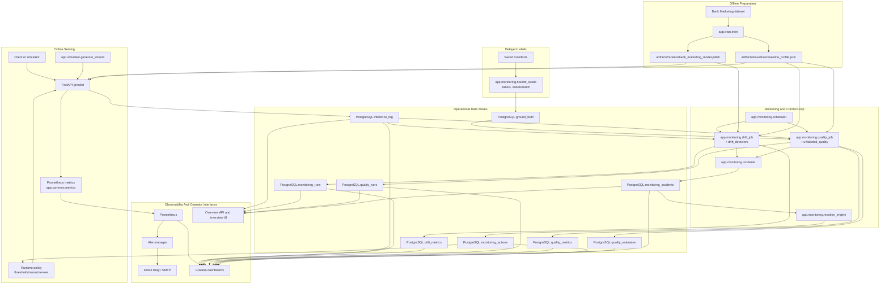

# Architecture

This document fixes the end-to-end architecture of the project as one
dataflow: from offline training and baseline generation to online
inference, delayed labels, monitoring, incidents, dashboards, and
automated reactions.

## System Diagram

## Main Flow

1. `app.train.train` trains the classifier and writes the model artifact and
   baseline profile.
2. `FastAPI /predict` loads those artifacts, serves inference, applies the
   current runtime policy, emits Prometheus metrics, and writes every request
   into `inference_log`.
3. Delayed labels arrive later through `/labels` or `/labels/batch`, usually
   from `app.monitoring.backfill_labels`, and are stored in `ground_truth`.
4. `app.monitoring.scheduler` periodically runs drift and quality jobs for the
   global stream and optionally for configured segments.
5. `app.monitoring.drift_job` reads recent inference windows and baseline
   artifacts, applies univariate and multivariate detectors, and writes
   `monitoring_runs` plus `drift_metrics`.
6. `app.monitoring.quality_job` reads recent labeled or unlabeled windows,
   computes labeled metrics, proxy metrics, and unlabeled estimates, then
   writes `quality_runs`, `quality_metrics`, and `quality_estimates`.
7. Monitoring results are synchronized into `monitoring_incidents`; critical
   incidents can trigger `reaction_engine`, which creates `monitoring_actions`
   and updates the runtime policy used by `/predict`.
8. Prometheus scrapes the API metrics, Alertmanager routes alert notifications,
   and Grafana combines Prometheus with PostgreSQL tables for dashboards.

## Architectural Layers

- Offline artifacts:
  `artifacts/models/` and `artifacts/baselines/` define the serving and
  monitoring reference point.
- Serving layer:
  `app/api/main.py` is the runtime boundary for inference, labels, monitoring
  APIs, and overview responses.
- Monitoring layer:
  `scheduler`, `drift_job`, `quality_job`, `drift_detectors`,
  `unlabeled_quality`, and `incidents` implement the periodic control loop.
- Response layer:
  `reaction_engine` turns critical monitoring state into auditable actions.
- Observability layer:
  Prometheus, Alertmanager, Grafana, the overview page, and the email relay
  expose monitoring state to operators.

## Why The Split Matters

- PostgreSQL stores detailed evidence for the thesis:
  raw inference events, delayed labels, runs, metrics, incidents, and actions.
- Prometheus stores operator-facing gauges and counters:
  freshness, severity, request rates, proxy signals, and segment summaries.
- Grafana combines both:
  time-series from Prometheus and tabular latest-state views from PostgreSQL.
- The reaction engine closes the loop:
  monitoring is not only descriptive but can also create auditable mitigation
  actions that influence the live inference path.
