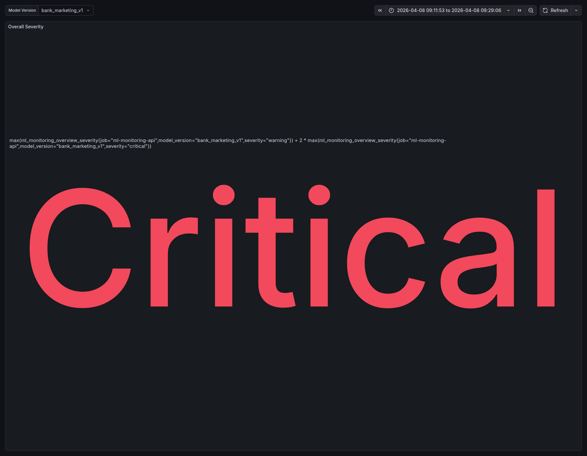
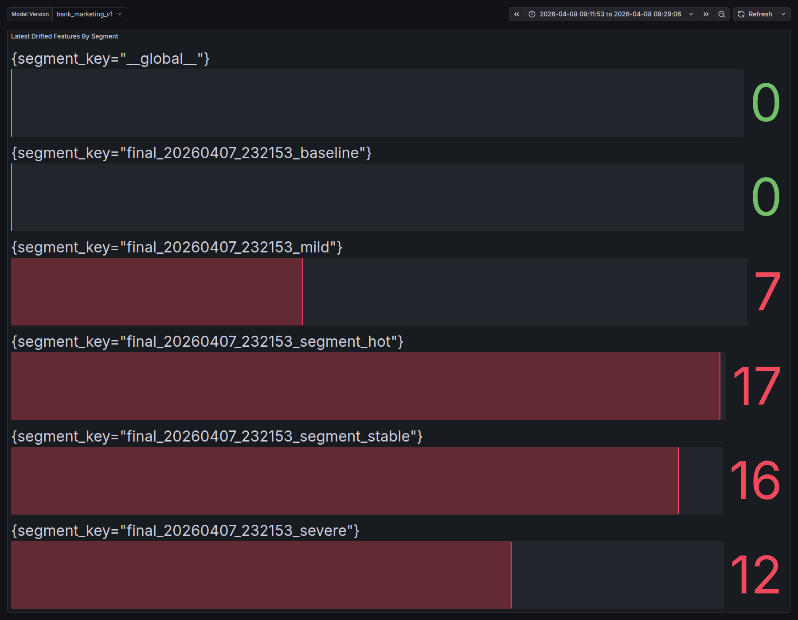
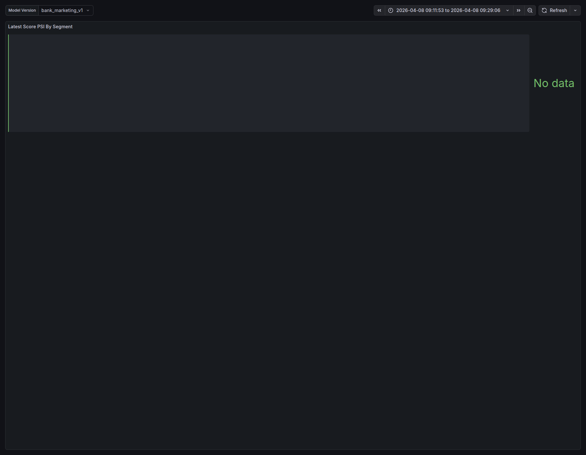

# Пример результатов

Этот документ фиксирует один пример результата локального запуска demo-flow.
Полные `artifacts/reports/final/` не коммитятся, потому что они
пересобираются локально и могут быть тяжелыми. Здесь сохранены компактные
артефакты, достаточные для быстрой проверки: таблица сценариев, 3 скриншота
Grafana и пример SQL-выгрузки по incident/action/rollback.

Источник примера: локальный экспорт `artifacts/reports/final/`, сформированный
`2026-04-07T23:24:36+00:00`.

## Сводка сценариев

| scenario | overall_drift | drifted_features_count | degraded_metrics_count | status | active_incidents | estimated_vs_true_metric_gap |
| --- | --- | ---: | ---: | --- | ---: | ---: |
| baseline | false | 0 | 0 | completed | 0 |  |
| mild | true | 7 | 3 | completed | 2 |  |
| severe | true | 12 | 4 | completed | 2 |  |
| proxy |  |  | 7 | completed | 1 | 0.416667 |
| segment | true | 17 | 6 | completed | 4 |  |

Интерпретация:

- baseline зеленый: контрольный сегмент не открывает drift/quality incident;
- mild и severe показывают рост числа признаков с дрейфом;
- proxy-сценарий фиксирует слепой период и сравнение proxy-оценки с поздней
  метрикой по меткам;
- segment-сценарий показывает локализацию проблем по сегментам.

## Скриншоты Grafana

### Overview



### Drift feature details



### Proxy label coverage



## SQL-выгрузка инцидентов

Пример запроса из финального экспорта:

```sql
SELECT
    mi.source_type,
    mi.segment_key,
    mi.severity,
    mi.status,
    mi.title,
    mi.recommended_action,
    mi.ts_opened,
    mi.latest_run_id
FROM monitoring_incidents mi
WHERE mi.segment_key IN (:stable_segment, :hot_segment)
ORDER BY mi.ts_opened DESC, mi.id DESC;
```

Фрагмент результата:

| source_type | segment_key | severity | status | title | latest_run_id |
| --- | --- | --- | --- | --- | ---: |
| quality | `final_20260407_232153_segment_hot` | critical | open | Quality degradation detected | 7 |
| drift | `final_20260407_232153_segment_hot` | critical | open | Drift monitoring signal | 5 |
| quality | `final_20260407_232153_segment_stable` | critical | open | Quality degradation detected | 6 |
| drift | `final_20260407_232153_segment_stable` | critical | open | Drift monitoring signal | 4 |

## SQL-выгрузка actions

Пример запроса из финального экспорта:

```sql
SELECT
    ma.action_id,
    mi.segment_key,
    ma.action_type,
    ma.status,
    ma.started_at,
    ma.ended_at,
    ma.trigger_reason
FROM monitoring_actions ma
JOIN monitoring_incidents mi
    ON mi.id = ma.incident_id
WHERE mi.segment_key IN (:stable_segment, :hot_segment)
ORDER BY ma.action_id DESC;
```

Фрагмент результата автоматического dry-run reaction engine:

| action_id | segment_key | action_type | status | trigger_reason |
| ---: | --- | --- | --- | --- |
| 10 | `final_20260407_232153_segment_hot` | tighten_threshold | dry_run | Automatic reaction for critical monitoring incident |
| 9 | `final_20260407_232153_segment_hot` | manual_review | dry_run | Automatic reaction for critical monitoring incident |
| 8 | `final_20260407_232153_segment_stable` | tighten_threshold | dry_run | Automatic reaction for critical monitoring incident |
| 7 | `final_20260407_232153_segment_stable` | manual_review | dry_run | Automatic reaction for critical monitoring incident |

## SQL-выгрузка rollback

Автоматический финальный экспорт работает в `dry_run` режиме, поэтому rollback
не требуется. Для защиты rollback демонстрируется вручную через
`POST /monitoring/actions/execute` и `POST /monitoring/actions/rollback`.
Форма SQL-выгрузки после ручного шага такая:

```sql
SELECT
    ma.action_id,
    ma.incident_id,
    ma.action_type,
    ma.status,
    ma.started_at,
    ma.ended_at,
    ma.trigger_reason,
    ma.old_config,
    ma.new_config
FROM monitoring_actions ma
WHERE ma.incident_id = :incident_id
ORDER BY ma.action_id ASC;
```

Пример ожидаемого результата после live execute + rollback:

| action_id | action_type | status | ended_at | trigger_reason |
| ---: | --- | --- | --- | --- |
| 11 | tighten_threshold | rolled_back | `2026-04-07 23:31:18+00` | defense demo |
| 12 | rollback_tighten_threshold | executed | `2026-04-07 23:31:18+00` | defense rollback |

Проверяемые признаки rollback:

- исходное действие получает `status=rolled_back` и заполненный `ended_at`;
- создается новая audit-строка `rollback_tighten_threshold`;
- `new_config` rollback-строки содержит `rollback_of_action_id`;
- runtime policy возвращается к предыдущему threshold/manual-review state.

## Как пересобрать

```bash
make demo
```

После запуска полный актуальный пакет будет лежать в
`artifacts/reports/final/`, а агрегированная таблица в
`artifacts/reports/final/scenario_summary.md`.
